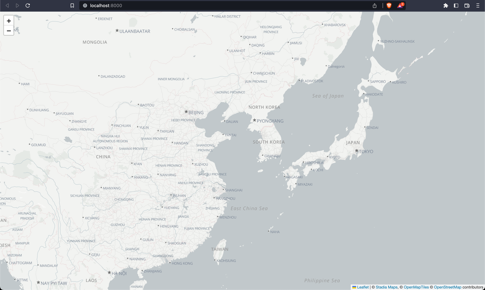
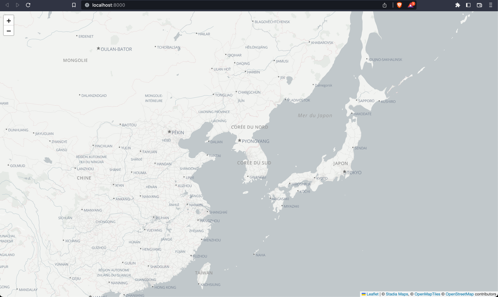

# Leaflet Custom Style Demo

This repo demonstrates how to use a custom vector map style with Leaflet.

Leaflet can only render raster tiles out of the box, and raster tiles are not
customizable client-side. While [MapLibre GL JS](https://github.com/maplibre/maplibre-gl-js)
is the reference for vector tile rendering, many developers prefer the familiar, battle-tested
Leaflet API.

This example shows you how to use a custom vector style with Leaflet using the
[maplibre-gl-leaflet](https://github.com/maplibre/maplibre-gl-leaflet) plugin,
giving your (more or less) the best of both worlds.

## Quickstart

1. Clone the repository.

2. Start a local web server in the directory. Here's a Python example.

    ```shell
    python3 -m http.server
    ```

3. Open the page in your web browser. Replace the port number if necessary. http://localhost:8000/

If you aren't running on `localhost` or `127.0.0.1`, you will to either register your domain or
generate an API key. See our [authentication guide](https://docs.stadiamaps.com/authentication/)
for more details.



Now you have everything you need to experiment with custom map styles in Leaflet!

## Details

It's worth unpacking a few of the details of how all this works and what you need to know in order
to do this in your own application.

### Markup/script

The included [index.html](index.html) is pretty straightforward. The only change from our published
[example](https://docs.stadiamaps.com/vector/#leaflet) is the style URL. You can host this anywhere;
most likely alongside your web application.

### Explanation of style changes

The JSON style may look like a lot, but we have only changed one key thing from our published styles.
For labels, we typically have an expression like this to control how text is displayed.

```json
"text-field": [
  "concat",
  [
    "get",
    "name:latin"
  ],
  [
    "case",
    [
      "all",
      [
        "has",
        "name:nonlatin"
      ],
      [
        "is-supported-script",
        [
          "get",
          "name:nonlatin"
        ]
      ]
    ],
    [
      "concat",
      "\n",
      [
        "get",
        "name:nonlatin"
      ]
    ],
    ""
  ]
]
```

In plain English, the above will render the latin name of a feature and, if a non-latin name exists,
it renders the label in local script on a second line. This lets us improve the readability of the
basemap to a wider audience while preserving local names.

However, this may not be necessary for all applications. What if we only care about a "western" audience?
The included [alidade_smooth_latin.json](alidade_smooth_latin.json) replaces the complex expression
with a simpler one, `"text-field": "{name:latin}"`, that only displays latin-readable labels.

But Latin does not necessarily mean a specific language! What if wanted the name in a specific language?
You can substitute `name:latin` with `name:en`, `name:ja` or any other supported language. We support
the following languages:

- `am` (Amharic)
- `ar` (Arabic)
- `az` (Azerbaijani, Latin)
- `be` (Belarusian)
- `bg` (Bulgarian)
- `br` (Breton, Latin)
- `bs` (Bosnian, Latin)
- `ca` (Catalan, Latin)
- `co` (Corsican, Latin)
- `cs` (Czech, Latin)
- `cy` (Welsh, Latin)
- `da` (Danish, Latin)
- `de` (German, Latin)
- `el` (Greek)
- `en` (English, Latin)
- `eo` (Esperanto, Latin)
- `es` (Spanish, Latin)
- `et` (Estonian, Latin)
- `eu` (Basque, Latin)
- `fi` (Finnish, Latin)
- `fr` (French, Latin)
- `fy` (Western Frisian, Latin)
- `ga` (Irish, Latin)
- `gd` (Scottish Gaelic, Latin)
- `he` (Hebrew)
- `hr` (Croatian, Latin)
- `hu` (Hungarian, Latin)
- `hy` (Armenian)
- `id` (Indonesian, Latin)
- `is` (Icelandic, Latin)
- `it` (Italian, Latin)
- `ja` (Japanese)
- `ja_kana` (Japanese Kana form)
- `ka` (Georgian)
- `kk` (Kazakh)
- `kn` (Kannada)
- `ko` (Korean)
- `ku` (Kurdish, Latin)
- `la` (Latin, Latin)
- `lb` (Luxembourgish, Latin)
- `lt` (Lithuanian, Latin)
- `lv` (Latvian, Latin)
- `mk` (Macedonian)
- `mt` (Maltese, Latin)
- `ml` (Malayalam)
- `nl` (Dutch, Latin)
- `no` (Norwegian, Latin)
- `oc` (Occitan (post 1500), Latin)
- `pl` (Polish, Latin)
- `pt` (Portuguese, Latin)
- `rm` (Romansh, Latin)
- `ro` (Romania, Latin)
- `ru` (Russian)
- `sk` (Slovak, Latin)
- `sl` (Slovene, Latin)
- `sq` (Albanian, Latin)
- `sr` (Serbian, Cyrillic)
- `sr-Latn` (Serbian, Latin)
- `sv` (Swedish, Latin)
- `th` (Thai)
- `tr` (Turkish, Latin)
- `uk` (Ukrainian)
- `zh` (Chinese)

You can get more complicated with an expression like the following, which will use a French label
if one exists, but fall back to any latin label and finally the original name if no specifically
tagged French name exists.

```json
"text-field": [
  "coalesce",
  [
    "get",
    "name:fr"
  ],
  [
    "get",
    "name:latin"
  ],
  [
    "get",
    "name"
  ]
]
```

An example has been included in `alidade_smooth_fr.json`. Edit the page to point to this file to see the
French labeled map.



## Further Reading

You can read more about creating custom styles in our [docs](https://docs.stadiamaps.com/custom-styles/).
The [MapLibre GL JSON style specification](https://maplibre.org/maplibre-gl-js-docs/style-spec/)
will be an invaluable reference for more complex style creation.
